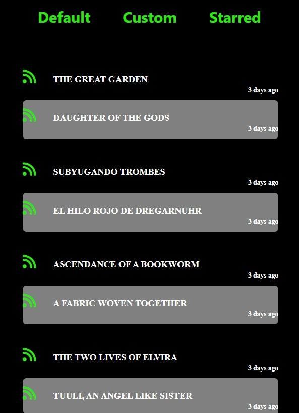

<a name="readme-top"></a>

[![Contributors][contributors-shield]][contributors-url]
[![Forks][forks-shield]][forks-url]
[![Stargazers][stars-shield]][stars-url]
[![Issues][issues-shield]][issues-url]


<!-- PROJECT LOGO -->
<br />
<div align="center">
  <a href="https://github.com/upes-open/Web-extension-custom-rss-reader">
    
  </a>

<h3 align="center">AO3 RSS Reader - Web Extension</h3>

  <p align="center">
    A web extension for accessing the RSS feeds of your favourite tags on <a href="https://archiveofourown.org/" target="_blank"> AO3 </a>
  </p>
</div>


<!-- TABLE OF CONTENTS -->
<details>
  <summary>Table of Contents</summary>
  <ol>
    <li>
      <a href="#about-the-project">About The Project</a>
      <ul>
        <li><a href="#built-with">Built With</a></li>
      </ul>
    </li>
    <li><a href="#contributing">Contributing</a></li>
    <li><a href="#license">License</a></li>
    <li><a href="#contact">Contact</a></li>
    <li><a href="#acknowledgments">Acknowledgments</a></li>
  </ol>
</details>


<!-- ABOUT THE PROJECT -->
## About The Project

</img>

This is a web extension made specifically for the website <a href="https://archiveofourown.org/" target = "_blank"> AO3 </a>, a non-profit website for tranformative works such as fanfiction, fanart, etc. 

You could read their RSS feed on a generic RSS reader found all over the internet, but quickly come across a problem. The feed is sorted by the latest published rather than the latest updated. So if you are reading something published, say, a year ago, you won't see the updates on that feed. You either have to go to the website or subscribe and receive updates through mail, both of which are far less convenient than receiving instant notifications through a web extension.

So that is where our role comes in! Since the RSS also gives information about when a work was last updated, we can create a custom RSS parser to display the latest content and package it as a web extension to make it more accessible.

<p align="right">(<a href="#readme-top">back to top</a>)</p>


### Built With

* 
* 
* 


<p align="right">(<a href="#readme-top">back to top</a>)</p>


<!-- ROADMAP -->


<!-- CONTRIBUTING -->
### How to contribute ?

> Star ⭐ and fork the repository... <br>
> Clone the repository on your local machine... <br>
```bash
  git clone https://github.com/upes-open/Web-extension-custom-rss-reader
```
Go to the project directory
```bash
  cd Web-extension-custom-rss-reader
```

> Get assigned yourself the issue you want to contribute.<br>
> Start working on the assigned issue.


<p align="right">(<a href="#readme-top">back to top</a>)</p>


<!-- CONTACT -->
## Contact

UPES OPEN Community : [Official website](https://upes-open.org/) 

Project Link: [https://github.com/upes-open/Web-extension-custom-rss-reader](https://github.com/upes-open/Web-extension-custom-rss-reader)


<p align="right">(<a href="#readme-top">back to top</a>)</p>


<!-- MARKDOWN LINKS & IMAGES -->
<!-- https://www.markdownguide.org/basic-syntax/#reference-style-links -->
[contributors-shield]: https://img.shields.io/github/contributors/upes-open/Web-extension-custom-rss-reader.svg?style=for-the-badge
[contributors-url]: https://github.com/upes-open/Web-extension-custom-rss-reader/graphs/contributors
[forks-shield]: https://img.shields.io/github/forks/upes-open/Web-extension-custom-rss-reader.svg?style=for-the-badge
[forks-url]: https://github.com/upes-open/Web-extension-custom-rss-reader/network/members
[stars-shield]: https://img.shields.io/github/stars/upes-open/Web-extension-custom-rss-reader.svg?style=for-the-badge
[stars-url]: https://github.com/upes-open/Web-extension-custom-rss-reader/stargazers
[issues-shield]: https://img.shields.io/github/issues/upes-open/Web-extension-custom-rss-reader.svg?style=for-the-badge
[issues-url]: https://github.com/upes-open/Web-extension-custom-rss-reader/issues